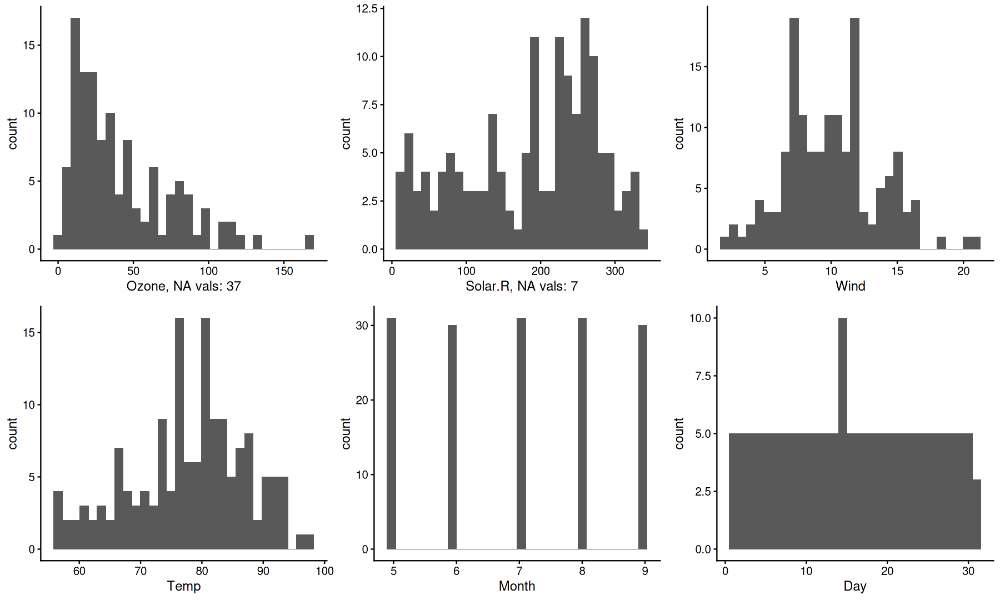
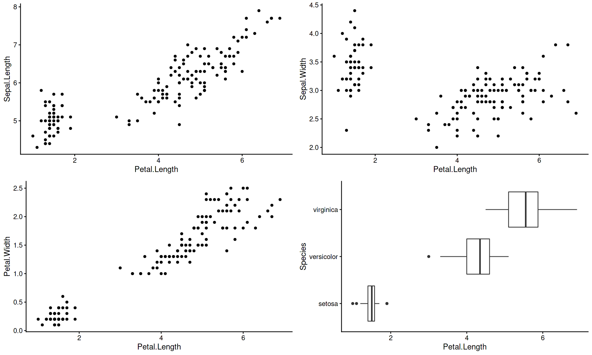
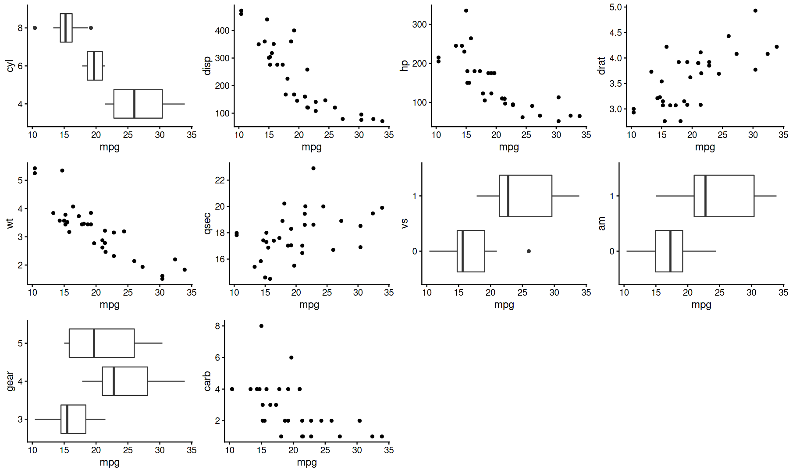
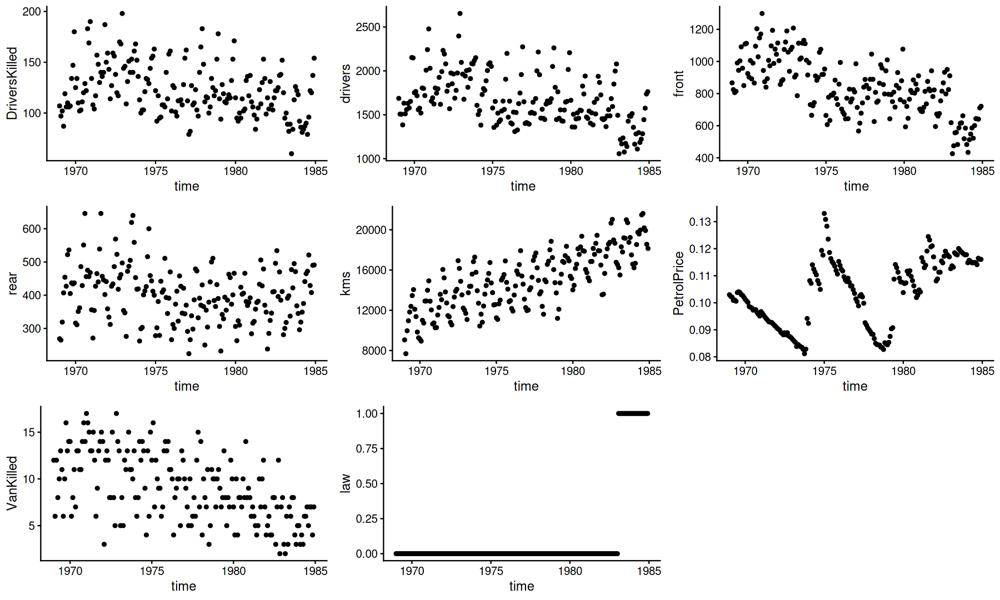
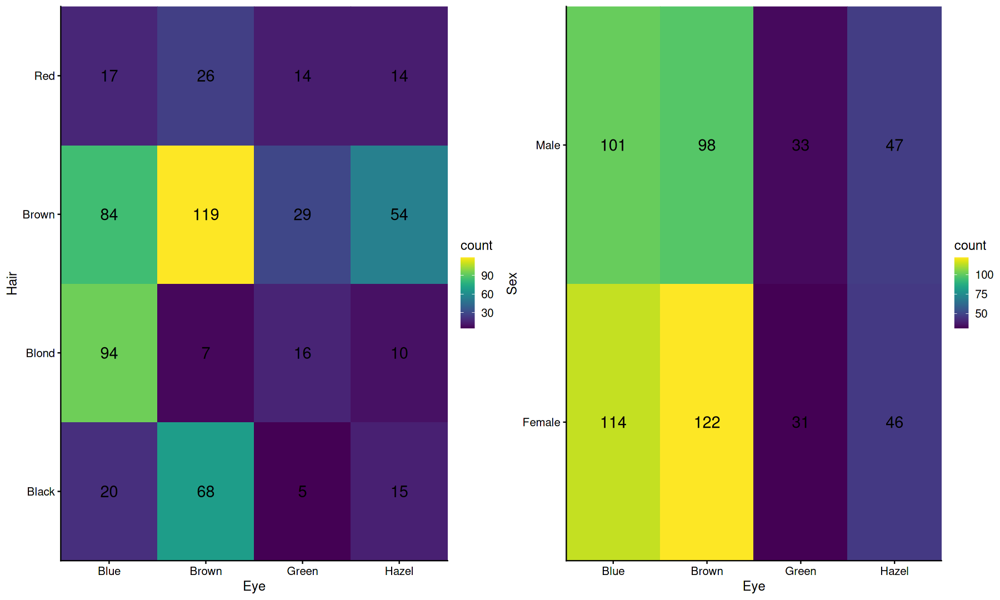
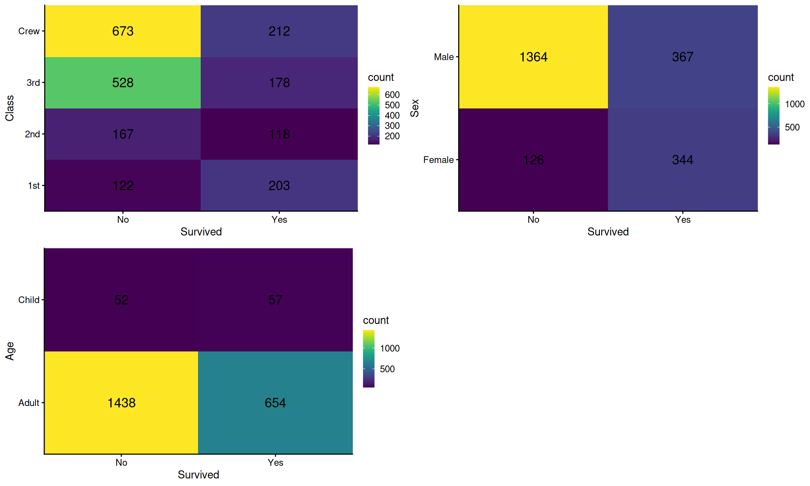
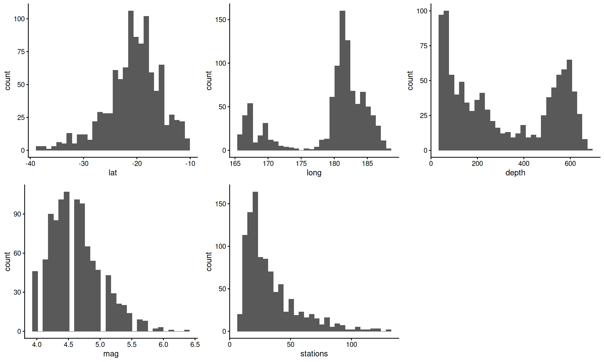
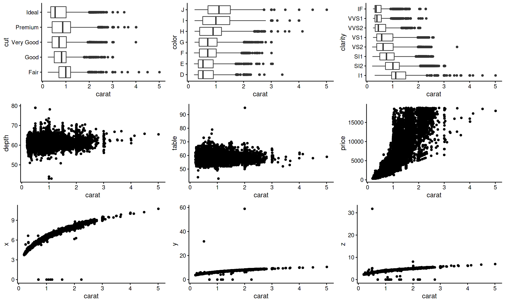
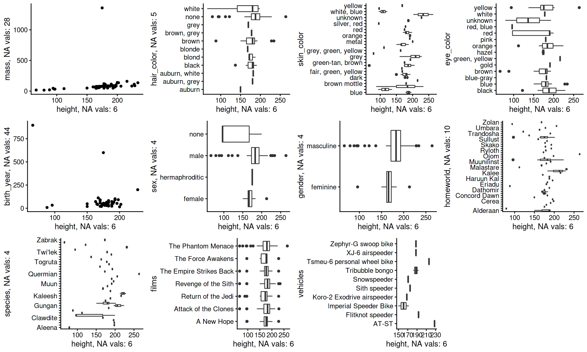
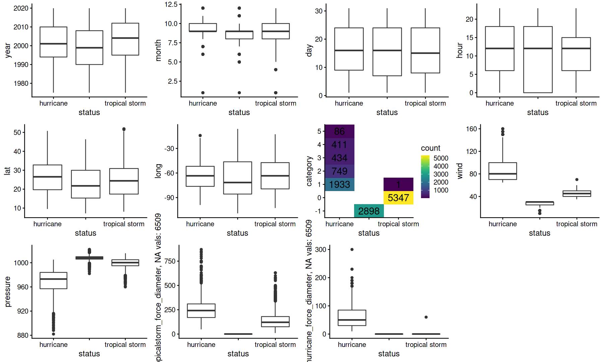

```R
library(gander)
options(repr.plot.width = 15, repr.plot.height = 9)
```

## gander
### quick and dirty visualization of your data.frame

the main idea here, is to have an easy to use function that will plot all your variables to get you started on exploratory analysis.

at a glance, you can see:
* how many variables you have
* how many observations you have
* distribution of values in each variable
* if a variable is discrete or continuous
* if there is any NA values
* interactions with a target variable


```R
# plot distribution of all variables 
gander(airquality)
```


    

    


```R
# plot one variable x all others
gander(iris, Petal.Length)
```


    

    


```R
suppressMessages(library(tidyverse))
# works nicely with tidyverse stuff
# modify your data.frame and pipe to gander
mutate_at(mtcars, c("cyl","vs","am","gear"), factor) %>% gander(mpg)
```


    

    


```R
# plot timeseries data
gander(Seatbelts, time)
```


    

    


```R
# plot table data
gander(HairEyeColor, Eye)
```


    

    


```R
gander(Titanic, Survived)
```


    

    


```R
gander(quakes)
```


    

    


```R
gander(diamonds, carat)
```


    

    


```R
select(starwars, -name, -starships) %>% gander(height)
```


    

    


```R
select(storms, -name) %>% gander(status)
```


    

    


```R

```


```R

```
